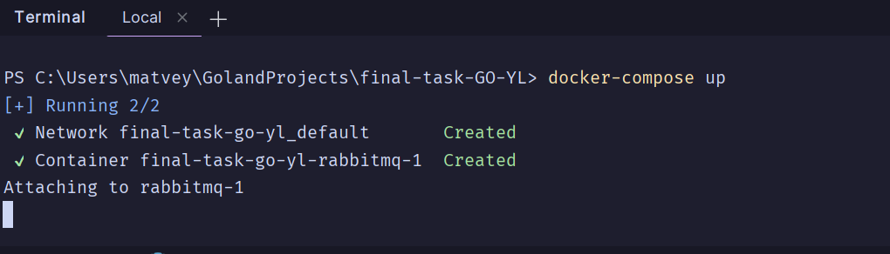
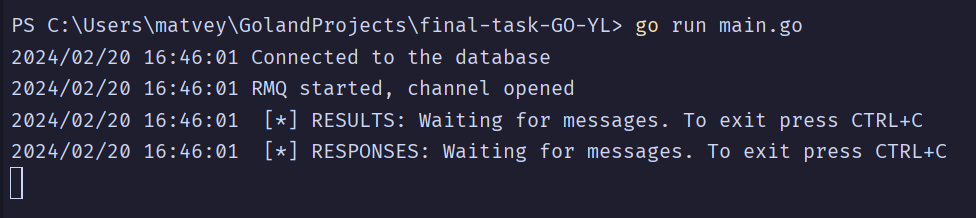
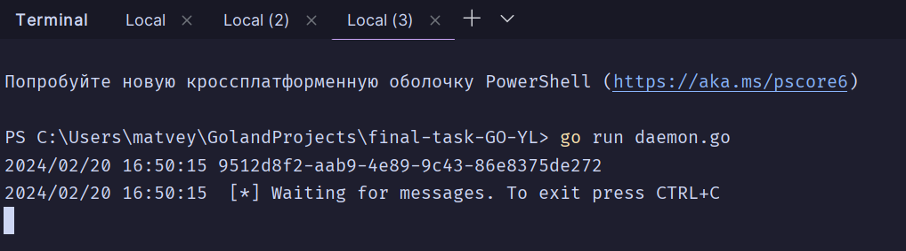
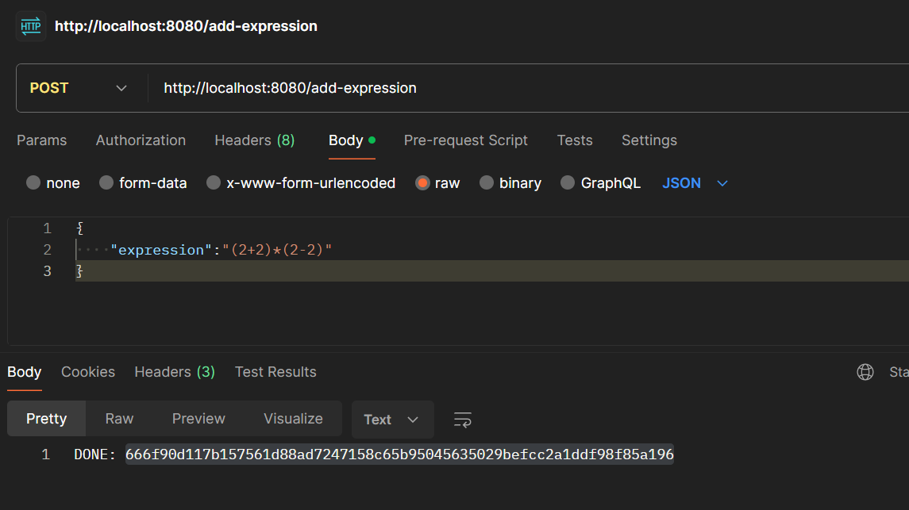
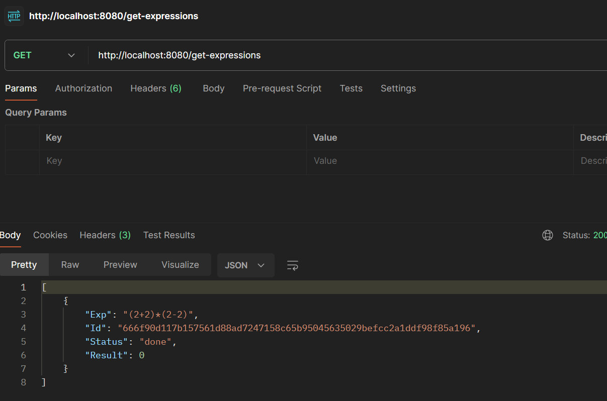
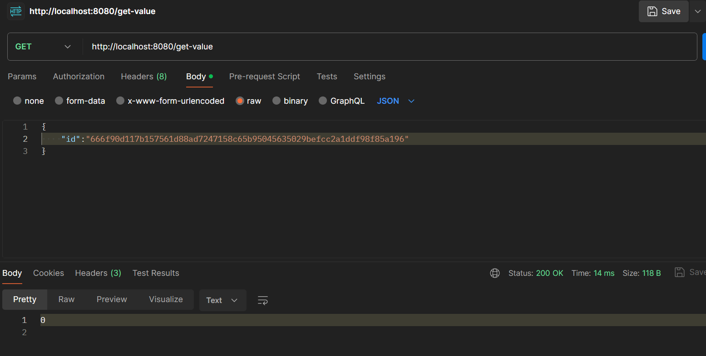
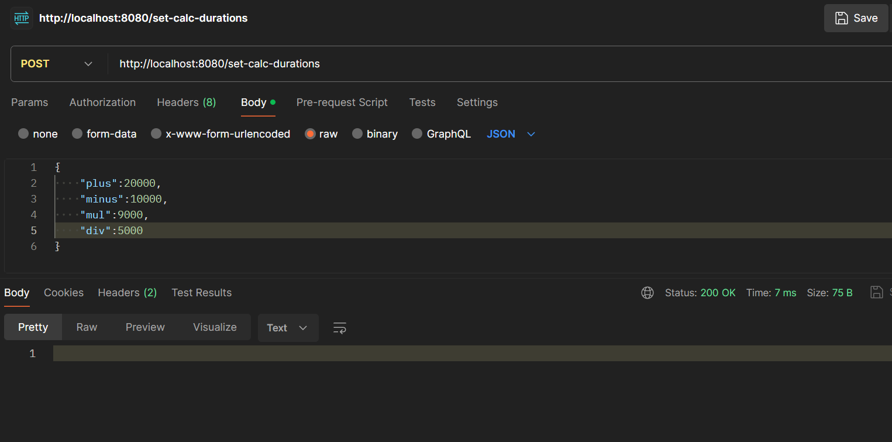
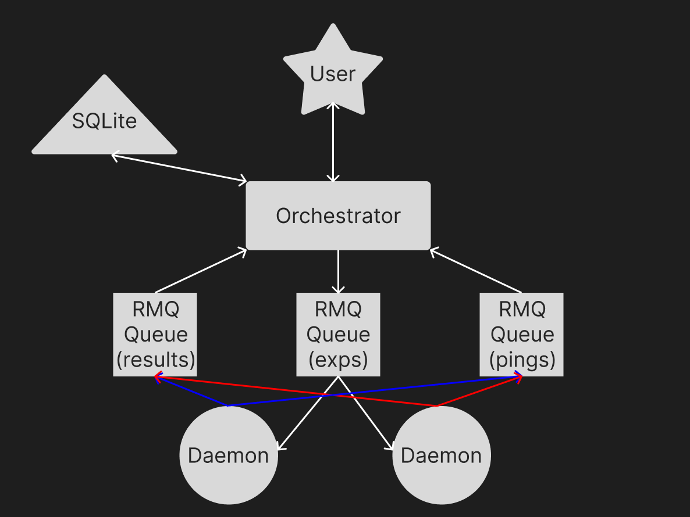

<h1>Оркестратор GO</h1>
Я только бекенд успел сделать. Ну хотя бы апишка работает. Для скачивания проекта воспользуйтесь git clone. Если что-то пойдет не так - гугл в помощь, но на крайняк мой тг - @m6sklv

<h3>Запуск docker</h3>
Для того чтобы заработал rabbitMQ надо запустить файлик <strong>docker-compose.yml</strong>
 Пишем в консольку <strong>docker-compose up</strong>
Должна вылезти такая штучка: 
И дальше много текста. Главное, чтобы в конце было чет вроде
<strong>Time to start RabbitMQ: 14678385 us</strong> (Цифры могут меняться)
<h3>Запуск оркестратора</h3>
Откроем новый терминал (все должны находиться в проекте!)
Пишем: <strong>go run main.go</strong>  
Если все ок, вылезет:

Эт значит что очереди в RMQ открыты
<h3>Запуск агента/демона</h3>
Запускаем ТРЕТИЙ терминал в той же папке и пишем <strong>go run daemon.go</strong>  
Если хотите больше агентов - запустите больше терминалов.

Периодически он будет писать successfully sent beat - эт норм.
Если все прошло успешно, можно открывать Postman и тестить APIшечку.

<h3>API</h3>
Для тестирования качаем Postman у кого его нет (можно и другими путями, наверное).
<h5>POST: http://localhost:8080/add-expression</h5>
Добавление выражения. Указываем без пробелов и не кривое!

На выходе, если все выполнилось правильно, вернется ID выражения, как на картинке
<h5>GET: http://localhost:8080/get-expressions</h5>
Тут ничего указывать не надо, вернется JSON со всеми сохраненными выражениями и их данными:

<h5>GET: http://localhost:8080/get-value</h5>
Указываем ID выражения, результат которого хотим узнать и получаем результат.
Если выражение еще не посчитано, об этом будет сообщено.

<h5>POST: http://localhost:8080/set-calc-durations</h5>
Здесь можно указать длительность подсчета каждого действия. Указываем в мс (миллисекундах). По дефолту - 200мс.
Если все хорошо - вернет статус 200.

При перезапуске компонентов система продолжает корректно работать, т.к. данные хранятся в СУБД. (ну вроде))
 Мониторинг воркеров работает в терминале (это heartbeat ес чо).
  Ну и схемка как это работает:

